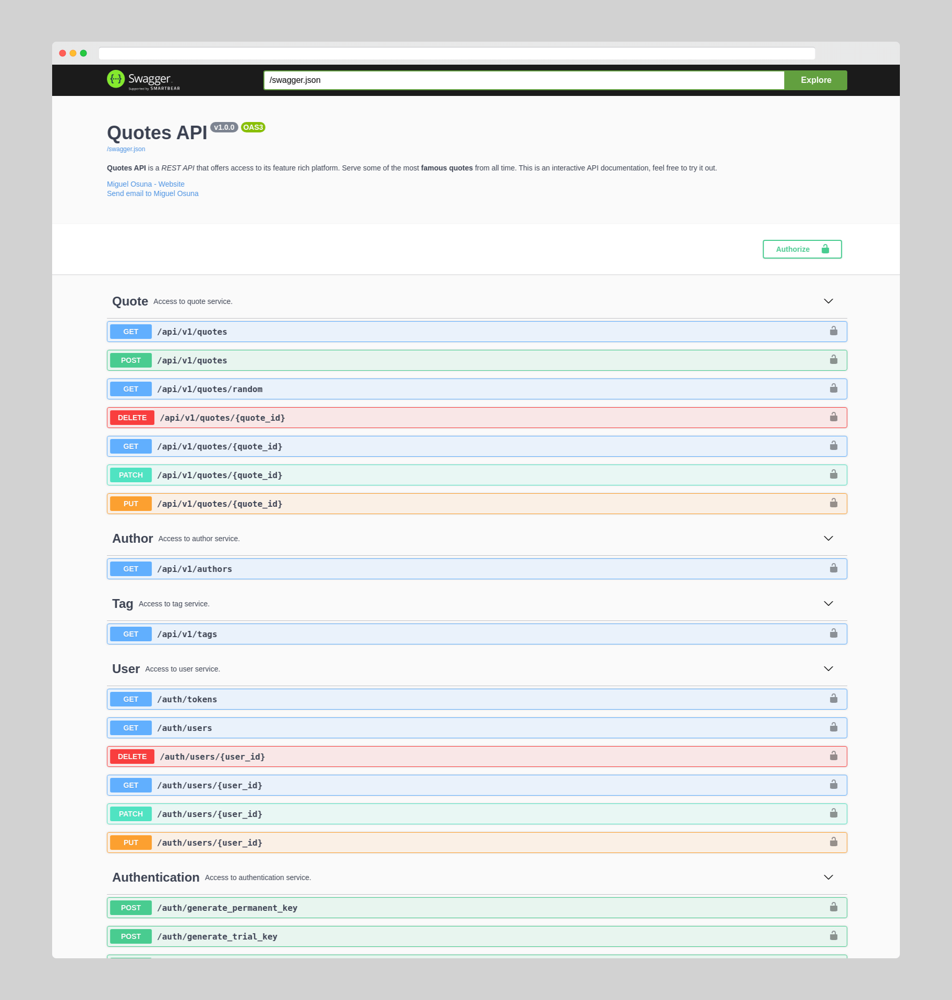

# Quotes-API

## :book: Description
RESTful API that serves the most famous quotes from all time. Built with Flask-RESTful.

### :dart: Features
- RESTful API created with Flask-RESTful
- MongoDB integration with Flask-Mongoengine
- Open API specification documentation

### :high_brightness: Visuals


## :bulb: Getting Started
Follow the instructions below to work on the project on your local environment.

### :clipboard: Prerequisites
In case you don't use Docker, you'll need Git, Python 3.8, Pip and a Virtual Environment (in this case, Pipenv is used as a package manager and virtual environment).

### :computer: Installation
```
# Clone this repository
$ git clone https://github.com/miguel-osuna/Quotes-API.git

# Go into the repository from the terminal
$ cd Quotes-API

# Remove current origin repository
$ git remote remove origin
```

All dependencies are listed on the Pipfile.

### :whale2: Running project with Docker
This will run the project on your local environment. 

Make sure to create a hidden folder like `envs.example` named `.envs`, with the same kind of environment variables.

```
docker-compose up -f local.yml up -d --build
```

## :rocket: Deployment
This project includes configuration files for both Heroku and AWS using Zappa.

- Heroku: read the [following tutorial](https://devcenter.heroku.com/articles/getting-started-with-python) to learn how to deploy to your heroku account..
- Zappa: read the [following tutorial](https://github.com/Miserlou/Zappa#installation-and-configuration) to learn how to deploy to your aws account using zappa.

## :wrench: Built With
- [Flask](https://flask.palletsprojects.com/en/1.1.x/) - Python Web Framework 
- [Zappa](https://github.com/Miserlou/Zappa) - Python Serverless Deployment Library
- [Heroku](https://heroku.com/) - Hosting Platform

## Project Documentation
See the [project documentation](https://elvxcu055k.execute-api.us-east-1.amazonaws.com/production/documentation)

## :performing_arts: Authors
- **Miguel Osuna** - https://github.com/miguel-osuna

## :ledger: License
This project is licensed under the MIT License - see the LICENSE.md file for details.
